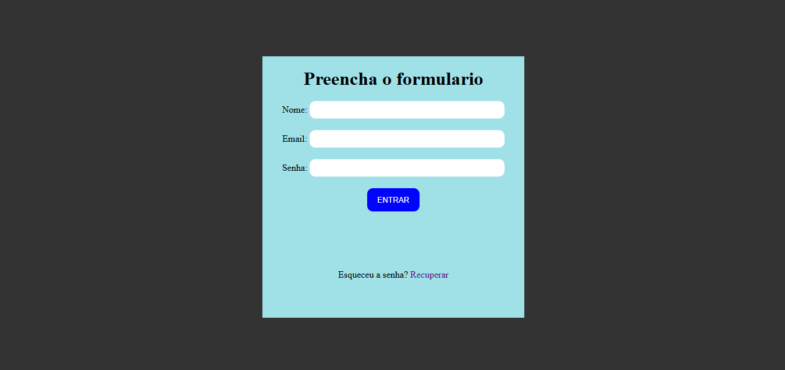

## Descrição

Este é um projeto simples de formulário de login, desenvolvido utilizando **React** e **CSS**. Ele exibe um formulário com campos para **Nome**, **Email**, **Senha** e um botão de **ENTRAR**. O formulário também possui um link para recuperação de senha. Este projeto foi desenvolvido como parte de uma aplicação de exemplo para demonstrar como trabalhar com componentes no React e estilizar com CSS.

## Funcionalidades

- **Formulário de Login**: O formulário solicita ao usuário seu **Nome**, **Email** e **Senha**.
- **Botão de Envio**: Um botão de envio chamado "ENTRAR", que pode ser usado para ativar ações de login.
- **Link de Recuperação de Senha**: Um link para o usuário que esqueceu a senha, que pode redirecionar para uma página de recuperação de senha.

## Tecnologias Usadas

- **React**: Biblioteca JavaScript para construção de interfaces de usuário.
- **CSS**: Estilos aplicados ao formulário e layout da página.
- **HTML5**: Estruturação do conteúdo da página, como os campos de entrada.
